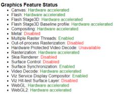

Project 0 Getting Started
====================

**University of Pennsylvania, CIS 565: GPU Programming and Architecture, Project 0**

* Dhruv Karthik
  * [LinkedIn](https://www.linkedin.com/in/dhruvkarthik/)
* Tested on: Ubuntu 18.04, Intel(R) Core(TM) i7-8700 CPU @ 3.20GHz, 16GM, GTX 2070 - Compute Capability 7.5 (Personal Computer)

### Write-Up

